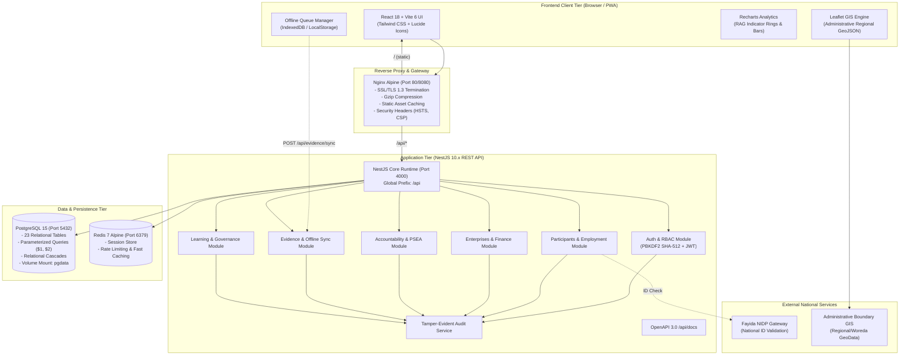
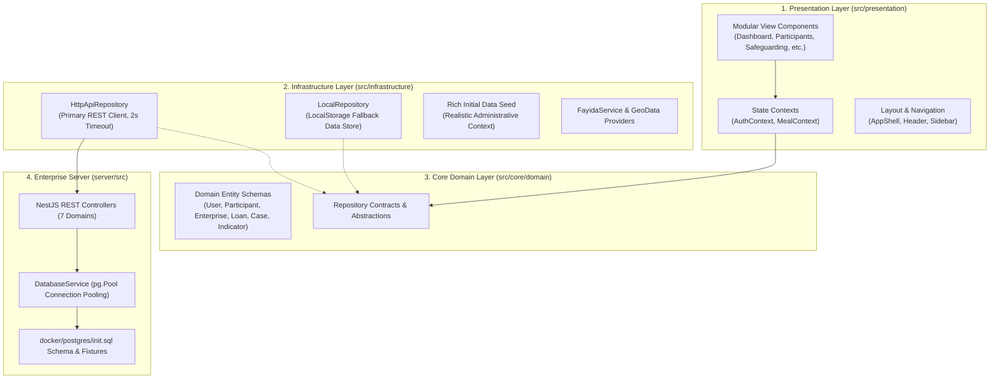
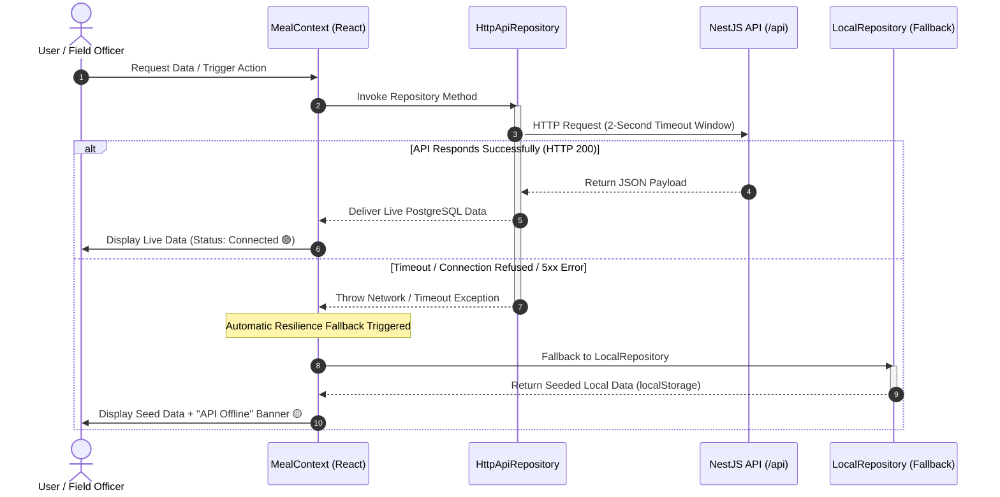
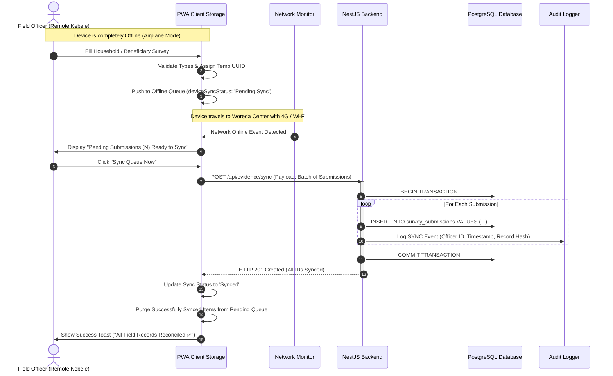
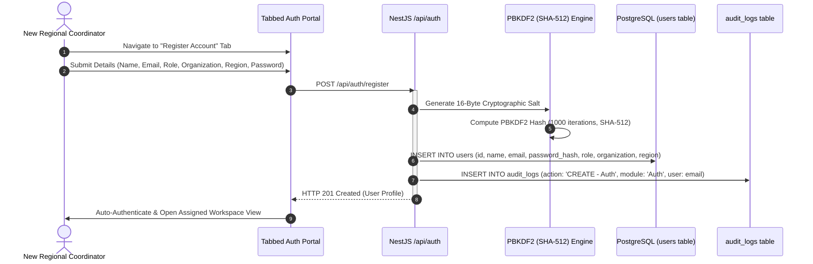
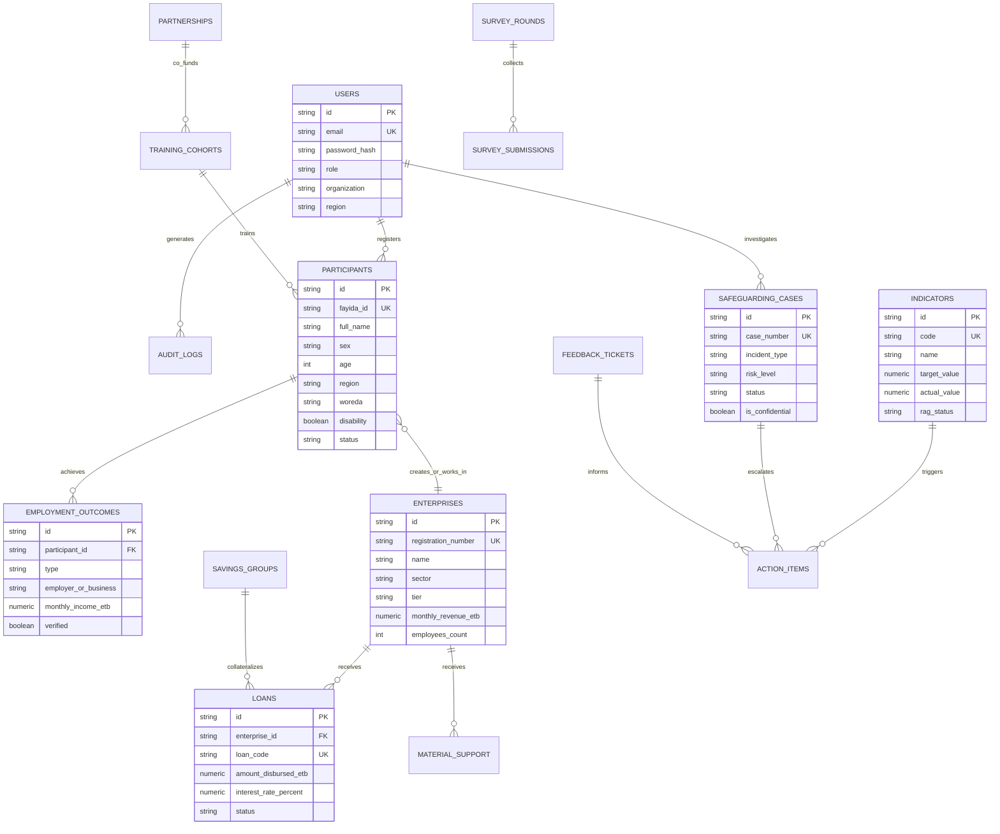

<div align="center">

# NexusMEAL Enterprise MIS
### Next-Generation Digital Monitoring, Evaluation, Accountability & Learning Platform
**National Youth Employment & Enterprise Development Programme**

[](https://www.postgresql.org/)
[](https://nestjs.com/)
[](https://react.dev/)
[](https://vitejs.dev/)
[](https://www.docker.com/)
[](https://tailwindcss.com/)
[](http://localhost:4000/api/docs)
[](#11-security-cryptography--compliance)

<br/>

> **Platform Mission & Scope:**  
> Developed as a modern, sovereign, enterprise-grade digital backbone orchestrating youth employment outcomes, micro-enterprise incubation, financial inclusion, safeguarding, and institutional learning across **8 administrative regions**.  
> The system replaces fragmented paper intake and disjointed spreadsheets with a real-time, tamper-evident Management Information System (MIS) designed for national-scale social development and donor-funded initiatives.

<p align="center">
  <a href="#-quick-start"> Quick Start</a> •
  <a href="#-system-architecture">Architecture</a> •
  <a href="#-offline-first-sync--resilience-lifecycle">Offline Sync</a> •
  <a href="#-database-schema--entity-relationships">Database & ERD</a> •
  <a href="#-comprehensive-module-matrix">Modules</a> •
  <a href="#-backend-api-reference">API Docs</a> •
  <a href="#-security-cryptography--compliance">Security & Law</a>
</p>

</div>

---

## Table of Contents

- [1. Executive Summary & Value Proposition](#1-executive-summary--value-proposition)
- [2. System Architecture](#2-system-architecture)
  - [2.1 High-Level Infrastructure Topology](#21-high-level-infrastructure-topology)
  - [2.2 Clean Architecture & Layered Design](#22-clean-architecture--layered-design)
  - [2.3 Dual-Mode Resilience & Graceful Degradation](#23-dual-mode-resilience--graceful-degradation)
- [3. Offline-First Sync & Resilience Lifecycle](#3-offline-first-sync--resilience-lifecycle)
- [4. Role-Based Access Control (RBAC) & Dynamic Auth](#4-role-based-access-control-rbac--dynamic-auth)
  - [4.1 Authentication & Registration Flow](#41-authentication--registration-flow)
  - [4.2 Permission & Governance Matrix](#42-permission--governance-matrix)
- [5. Database Schema & Entity Relationships](#5-database-schema--entity-relationships)
  - [5.1 Entity-Relationship Diagram (ERD)](#51-entity-relationship-diagram-erd)
  - [5.2 Production Tables & Relational Integrity](#52-production-tables--relational-integrity)
- [6. Comprehensive Module Matrix (28+ Modules)](#6-comprehensive-module-matrix-28-modules)
  - [Suite A: Beneficiary & Operations Engine](#suite-a-beneficiary--operations-engine)
  - [Suite B: MEAL & Evidence Intelligence](#suite-b-meal--evidence-intelligence)
  - [Suite C: Financial Inclusion & Capital Flow](#suite-c-financial-inclusion--capital-flow)
  - [Suite D: Safeguarding, AAP & Governance](#suite-d-safeguarding-aap--governance)
  - [Suite E: Knowledge, Learning & SBCC](#suite-e-knowledge-learning--sbcc)
  - [Suite F: Insight, Donor Reporting & Audit](#suite-f-insight-donor-reporting--audit)
- [7. National Integrations & Spatial GIS](#7-national-integrations--spatial-gis)
  - [7.1 Fayida National Digital ID (NIDP)](#71-fayida-national-digital-id-nidp)
  - [7.2 Geospatial Engine (GeoJSON + Leaflet)](#72-geospatial-engine-geojson--leaflet)
- [8. Technology Stack](#8-technology-stack)
- [9. Quick Start & Execution Guide](#9-quick-start--execution-guide)
  - [9.1 Option A: Full-Stack Docker Deployment (Recommended)](#91-option-a-full-stack-docker-deployment-recommended)
  - [9.2 Option B: Local Frontend Development](#92-option-b-local-frontend-development)
  - [9.3 Option C: Local Backend Development](#93-option-c-local-backend-development)
- [10. Backend API Reference (OpenAPI / Swagger)](#10-backend-api-reference-openapi--swagger)
- [11. Security, Cryptography & Compliance](#11-security-cryptography--compliance)
- [12. 15-Minute Executive Demo & Presentation Script](#12-15-minute-executive-demo--presentation-script)
- [13. Repository Structure](#13-repository-structure)
- [14. Programme Pillars & Attribution](#14-programme-pillars--attribution)

---

## 1. Executive Summary & Value Proposition

Prior to this platform, large-scale employment initiatives faced acute operational bottlenecks: fragmented paper intake registries, disconnected spreadsheets, delayed quarterly consolidations, duplicate identities across administrative woredas, and survey submissions with high latency.

**NexusMEAL Enterprise MIS** establishes a unified, resilient, national-scale digital command center:

```
[Remote Field Woredas]          [Regional Hubs]             [National PMU & Donors]
  Offline PWA Form Intake  ──►  Batch Sync & Validation ──►  Real-time RAG Indicators
  (Fayida ID Verification)       (RBAC Regional Isolation)   (Audit Trail, CSV & GIS)
```

### Core Capabilities
- **Massive Scale Tracking:** Designed for 50,000+ youth beneficiaries and 3,500+ micro-enterprises across 8 administrative regions (Addis Ababa, Oromia, Amhara, Sidama, Somali, Tigray, Afar, and Dire Dawa).
- **Zero Data Loss via Offline PWA:** Field officers collect survey submissions and intake profiles in remote areas without internet; submissions automatically queue in encrypted local storage and batch sync upon reconnection.
- **National Digital ID (Fayida) Integration:** Pre-wired against the National Digital ID Platform (NIDP) for cryptographic deduplication and citizen identity verification.
- **Continuous Indicator Intelligence:** Automatic live recalculation of PIRS (Performance Indicator Reference Sheets) logframe targets with RAG (Red/Amber/Green) scoring.
- **Strict Data Sovereignty:** Full architectural alignment with **Personal Data Protection Proclamation No. 1321/2024** and international PSEA (Prevention of Sexual Exploitation and Abuse) protocols.

---

## 2. System Architecture

The platform adopts a decoupled, micro-containerized architecture following **Clean Architecture** and **Domain-Driven Design (DDD)** principles.

### 2.1 High-Level Infrastructure Topology



---

### 2.2 Clean Architecture & Layered Design

The codebase enforces strict boundary separation across domain models, data providers, and UI presentation:



---

### 2.3 Dual-Mode Resilience & Graceful Degradation

A core design feature of the platform is **Zero-Downtime Graceful Degradation**. Field officers and project stakeholders can evaluate or demonstrate the platform without requiring a live PostgreSQL instance running locally.



---

## 3. Offline-First Sync & Resilience Lifecycle

Field teams operating in remote woredas often have zero cellular connectivity. The platform implements an offline queue architecture guaranteeing that all interviews, beneficiary intakes, and evidence logs are preserved and atomically ingested upon re-establishing connection.



---

## 4. Role-Based Access Control (RBAC) & Dynamic Auth

### 4.1 Authentication & Registration Flow

The platform provides an enterprise authentication portal supporting both **Officer Sign In** and **Dynamic Stakeholder Self-Registration**:



> [!IMPORTANT]
> **Zero Static Login Bypasses:** In adherence to enterprise data protection standards, credentials and registrations are cryptographically evaluated against PostgreSQL records via timing-safe comparisons.

---

### 4.2 Permission & Governance Matrix

Access control is enforced at three distinct layers:
1. **Sidebar Navigation Guard:** Inaccessible routes are hidden from unauthorized menus.
2. **React Presentation Guard:** Action buttons (create, edit, verify, delete, export) are rendered conditionally.
3. **NestJS Controller Guard:** Write endpoints perform server-side permission validation.

| System Role | Primary Constituency | View Finance | View Safeguarding | Manage Users | Export Reports | Mutate Indicators | Offline Sync |
|:---|:---|:---:|:---:|:---:|:---:|:---:|:---:|
| **Super Admin** | Programme PMU / System Directorate | ✅ | ✅ | ✅ | ✅ | ✅ | ✅ |
| **Programme Manager** | National Steering Committee | ✅ | ✅ | ❌ | ✅ | ✅ | ✅ |
| **Monitoring Officer** | Regional MEAL Team | ❌ | ✅ | ❌ | ✅ | ✅ | ✅ |
| **Partner Officer** | Implementing Partners & MFIs | ❌ | ❌ | ❌ | ❌ | ❌ | ❌ |
| **Field Officer** | Woreda Extension Workers | ❌ | ❌ | ❌ | ❌ | ❌ | ✅ |
| **Finance Officer** | Grant & Fund Managers | ✅ | ❌ | ❌ | ✅ | ❌ | ❌ |
| **Donor Viewer** | Institutional Donors & Delegations | ❌ *(Audit)* | ❌ *(Protected)*| ❌ | ❌ *(Read)* | ❌ | ❌ |

---

## 5. Database Schema & Entity Relationships

The relational data tier runs on PostgreSQL 15, structured into 23 specialized tables with foreign key constraints, indexation, and parameterized query execution.

### 5.1 Entity-Relationship Diagram (ERD)



---

### 5.2 Production Tables & Relational Integrity

| Table Identifier | Primary Key | Description & Integrity Rule |
|---|---|---|
| `users` | `id` (VARCHAR) | Stakeholder accounts with salted PBKDF2 password hashes & assigned regions |
| `participants` | `id` (VARCHAR) | Beneficiary registry with unique `fayida_id` constraint |
| `employment_outcomes` | `id` (VARCHAR) | Job placement tracking cascading on `participant_id` deletion |
| `enterprises` | `id` (VARCHAR) | MSME registry with `registration_number` and tier classification |
| `training_cohorts` | `id` (VARCHAR) | TVET vocational sessions tracking female/male enrolments and completions |
| `partnerships` | `id` (VARCHAR) | Institutional MoUs (MFIs, TVETs, Government agencies, Private sector) |
| `loans` | `id` (VARCHAR) | Concessionary MFI debt capital with repayment schedules and interest rates |
| `savings_groups` | `id` (VARCHAR) | Community VSLA groups tracking collective savings and internal lending |
| `budget_lines` | `id` (VARCHAR) | 6 major grant budget components with variance and burn rate monitoring |
| `material_support` | `id` (VARCHAR) | Asset disbursements (sewing machines, processing tools) with serials |
| `safeguarding_cases`| `id` (VARCHAR) | Confidential PSEA incidents with 48h SLA acknowledgment workflows |
| `feedback_tickets` | `id` (VARCHAR) | Accountability to Affected Populations (AAP) CRM tickets |
| `action_items` | `id` (VARCHAR) | Cross-module corrective action tracker with priority & deadlines |
| `lessons_learned` | `id` (VARCHAR) | Institutional knowledge repository tagged by pillar, quarter, and region |
| `knowledge_documents`| `id` (VARCHAR) | Versioned document library for PIRS sheets, manuals, and evaluations |
| `learning_agenda` | `id` (VARCHAR) | Research questions guiding the programme's adaptive management |
| `reflection_meetings`| `id` (VARCHAR) | Monthly reviews and reflection minutes with action linkage |
| `indicators` | `id` (VARCHAR) | Master PIRS logframe indicators with dynamic RAG status calculation |
| `survey_rounds` | `id` (VARCHAR) | Baseline, Midline, and Endline evaluation rounds across target samples |
| `survey_submissions` | `id` (VARCHAR) | Ingested offline mobile survey responses with geo-coordinates |
| `sbcc_activities` | `id` (VARCHAR) | Behaviour change campaigns (radio, workshops, community dialogues) |
| `governance_bodies` | `id` (VARCHAR) | Steering committees and technical working groups with TOR documentation |
| `audit_logs` | `id` (VARCHAR) | Append-only, tamper-evident log of all system writes, exports, and syncs |

---

## 6. Comprehensive Module Matrix (28+ Modules)

The platform organizes 28+ production modules into 6 cohesive domain suites:

### Suite A: Beneficiary & Operations Engine
* **Participant Registry (`/participants`):** 50,000+ youth records, Fayida National ID validation, 3-level geographic drilldown (Region → Woreda → Kebele), disability disaggregation.
* **Employment Outcomes (`/employment`):** Verification workflow for wage, self-employment, and apprenticeships with monthly income tracking.
* **Women Empowerment Tracker (`/women`):** Cross-cutting gender dashboard enforcing minimum 60% female target across jobs, TVET, loans, and VSLAs.
* **Enterprise Development (`/enterprises`):** MSME classification (Tier 1–3), monthly revenue tracking, youth and female employment generation counts.
* **Material & Technical Support (`/materials`):** Asset tracking with unique `MAT-XXX-YYYY-NNN` reference codes, supplier audits, and valuation dashboards.
* **Training Cohorts (`/training`):** TVET partnership tracking, attendance rates, curriculum hours, graduation ratios, and job placement correlation.

### Suite B: MEAL & Evidence Intelligence
* **Indicator Register & KPIs (`/register`):** Master PIRS matrix with real-time target-vs-actual variance, logframe pillar tagging, and automated RAG coloring.
* **GIS Spatial Map (`/map`):** Leaflet GIS map visualizing regional reach across 8 administrative territories with interactive drilldowns and density rings.
* **Evaluation Surveys (`/surveys`):** Structured Baseline, Midline, Endline, and Rapid Assessment round management.
* **Compare Rounds (`/compare`):** Multi-wave longitudinal variance analysis comparing baseline indicators against current midline achievements.
* **Offline Queue (`/offline`):** Field officer synchronization hub for reviewing locally cached forms and triggering atomic batch syncs.

### Suite C: Financial Inclusion & Capital Flow
* **Financial Overview & Budget (`/finance`):** High-level utilization dashboard tracking core programme budget envelopes with burn rate analytics.
* **Concessionary Loan Tracking (`/loans`):** MFI disbursements with reference codes (`LN-XXX-YYYY`), repayment rates, and female share.
* **Savings Groups (VSLA) (`/savings`):** Grassroots Village Savings and Loan Associations tracking member shares, cumulative savings, and internal loan cycles.

### Suite D: Safeguarding, AAP & Governance
* **Safeguarding & PSEA (`/safeguarding`):** Zero-tolerance confidential incident reporting. Strict 48-hour acknowledgment and 30-day resolution SLA workflows.
* **Feedback CRM (`/feedback`):** Community grievance and feedback mechanism categorizing complaints, queries, and appreciations.
* **Action Tracker (`/actions`):** Unified task tracker synthesizing remedial actions from review meetings, safeguarding cases, and field monitoring visits.
* **Governance Bodies (`/governance`):** Terms of reference, membership rosters, and meeting schedules for Programme Steering Committees and MEAL TWGs.

### Suite E: Knowledge, Learning & SBCC
* **SBCC Campaign Tracker (`/sbcc`):** Demand-side interventions tracking radio broadcasts, community dialogues, and workshops with sex-disaggregated reach metrics.
* **Lessons Learned Repository (`/learning`):** Structured repository capturing implementation context, core lesson statements, and operational recommendations.
* **Knowledge Document Library (`/knowledge`):** Central repository for PIRS reference sheets, SOP manuals, survey instruments, and donor deliverables.
* **Learning Agenda (`/agenda`):** Structured adaptive management research questions paired with lead investigators and evidence findings.
* **Reflection Meetings (`/meetings`):** Log of monthly regional reviews and stakeholder joint reflections with automated action extraction.

### Suite F: Insight, Donor Reporting & Audit
* **Executive Command Dashboard (`/dashboard`):** Real-time KPI summaries, regional coverage heatmaps, and programme health status cards.
* **Automated Donor Reporting Engine (`/reports`):** One-click generation of Quarterly MEAL Summaries, Logframe Matrices, and Financial Variance Reports with true CSV export and print-ready formatting.
* **User & Stakeholder Administration (`/admin`):** Officer directory, organization assignment, and active session auditing.
* **Immutable Audit Trail (`/audit`):** Non-repudiation log recording user ID, action type, affected entity, timestamp, and IP address for every mutation.
* **Regulatory Compliance Panel (`/compliance`):** Live audit verification against Personal Data Protection Proclamation No. 1321/2024 and international donor safeguards.

---

## 7. National Integrations & Spatial GIS

### 7.1 Fayida National Digital ID (NIDP)

The platform features an architectural integration stub located at `src/infrastructure/integrations/FayidaService.ts`:
- **Format Verification:** Validates the official Fayida 16-character alphanumeric pattern.
- **Biometric Deduplication:** Simulates verification against the National ID server to prevent double-enrolment across differing regional woredas.
- **Consent Governance:** Manages beneficiary consent tokens in compliance with national privacy statutes.

```typescript
// Sample verification signature
export interface FayidaVerificationResult {
  verified: boolean;
  fayidaId: string;
  fullNameAmharic?: string;
  fullNameEnglish?: string;
  dob?: string;
  gender?: 'M' | 'F';
  issueRegion?: string;
  verificationTimestamp: string;
}
```

### 7.2 Geospatial Engine (GeoJSON + Leaflet)

The GIS module in `src/infrastructure/integrations/GeoData.ts` incorporates official boundary coordinates for all administrative regions:
* **Interactive Markers:** Scaled proportionally to regional beneficiary concentration.
* **Choropleth Heatmaps:** Dynamic color gradients based on target achievement percentages.
* **Regional Fly-To Drilldowns:** Clicking any regional card repositions the map viewport with animated bounding transitions.

---

## 8. Technology Stack

```
Frontend Architecture                     Backend & Persistence Architecture
┌──────────────────────────────────────┐  ┌──────────────────────────────────────┐
│  React 18.3 (Component Hierarchy)   │  │  NestJS 10.x (TypeScript Framework)  │
│  TypeScript 5.7 (Strict Typing)      │  │  Swagger / OpenAPI 3.0 (Docs)       │
│  Vite 6.0 (HMR & Rollup Bundling)    │  │  node-postgres (pg.Pool Connection)  │
│  Tailwind CSS 3.4 (Royal Blue/Gold)  │  │  PostgreSQL 15 Alpine (Relational)   │
│  Leaflet 1.9 & React-Leaflet         │  │  Redis 7 Alpine (Session & Cache)   │
│  Recharts 2.15 (Data Visualization)  │  │  Nginx Alpine (Reverse Proxy)        │
│  Lucide React (Icon System)          │  │  Docker & Docker Compose v2          │
└──────────────────────────────────────┘  └──────────────────────────────────────┘
```

---

## 9. Quick Start & Execution Guide

### 9.1 Option A: Full-Stack Docker Deployment (Recommended)

The entire multi-tier stack (PostgreSQL, NestJS API, Redis, Nginx Reverse Proxy, and React Frontend) can be initialized with a single command:

```bash
# 1. Clone the repository
git clone https://github.com/DawitGereziher/MIS-platform.git
cd MIS-platform

# 2. Build and launch all containerized services
docker compose up --build
```

#### Running Endpoints

| Service | Access URL | Default Port | Description |
|---|---|:---:|---|
| **Web Frontend** | `http://localhost:8080` | 8080 | Production Nginx serving built SPA |
| **Backend REST API** | `http://localhost:4000/api` | 4000 | NestJS core API |
| **Interactive API Docs** | `http://localhost:4000/api/docs` | 4000 | Swagger OpenAPI interactive interface |
| **PostgreSQL Database** | `localhost:5432` | 5432 | Direct DB connection (user: `meal_admin`) |
| **Redis Cache** | `localhost:6379` | 6379 | In-memory key-value cache |

> [!NOTE]
> On first initialization, `docker/postgres/init.sql` automatically populates the database with 23 tables, pre-configured roles, and over 100 realistic seed records.

---

### 9.2 Option B: Local Frontend Development

If you wish to run only the frontend for quick UI demonstrations (the system will automatically fall back to its internal seed data store):

```bash
# Install frontend dependencies
npm install

# Start Vite development server
npm run dev
```
Navigate to `http://localhost:5173`. The application will detect that the backend is offline and seamlessly activate `LocalRepository` with complete demonstration data.

---

### 9.3 Option C: Local Backend Development

To develop and test the NestJS backend locally:

```bash
cd server

# Install backend dependencies
npm install

# Launch NestJS in watch mode
npm run start:dev
```
The API server will listen on `http://localhost:4000/api`.

---

### Pre-Seeded Demonstration Accounts

All accounts share the secure demonstration password: `MealDemo@2026`

| Assigned Role | Email Address | Jurisdiction | Authorized Capabilities |
|---|---|---|---|
| **Super Admin** | `admin@demo.meal.et` | National PMU | Full, unrestricted read/write/audit privileges |
| **Programme Manager** | `programme_manager@demo.meal.et` | National PMU | Executive dashboards, PIRS modification, financial overview |
| **Monitoring Officer** | `monitoring_officer@demo.meal.et` | Addis Ababa Hub | Survey analysis, indicator tracking, verification workflows |
| **Partner Officer** | `partner_officer@demo.meal.et` | Partner Liaison | Partnership tracking, feedback review, enterprise registry |
| **Field Officer** | `field_officer@demo.meal.et` | Oromia Field Unit | Participant enrollment, offline queue, survey submission |
| **Finance Officer** | `finance_officer@demo.meal.et` | Finance Operations | Budget lines, MFI loan tracking, material asset costs |
| **Donor Viewer** | `donor_viewer@demo.meal.et` | International Donor | Read-only executive reports, logframe matrices, compliance |

---

## 10. Backend API Reference (OpenAPI / Swagger)

Interactive API documentation with live execution capabilities is available at `http://localhost:4000/api/docs`.

```
Summary of Core Enterprise Endpoints:
```

<details>
<summary><b>Authentication & User Governance (<code>/api/auth</code>)</b></summary>

| Verb | Path | Summary / Description |
|:---:|:---|:---|
| `POST` | `/api/auth/login` | Authenticate against PostgreSQL; returns authenticated session profile |
| `POST` | `/api/auth/register` | Register new stakeholder with salted PBKDF2 password encryption |
| `GET` | `/api/auth/users` | List all registered officers with roles and organizations |
| `GET` | `/api/auth/me` | Fetch currently authenticated user context |

</details>

<details>
<summary><b>👥 Beneficiary & Employment Endpoints (<code>/api/participants</code>)</b></summary>

| Verb | Path | Summary / Description |
|:---:|:---|:---|
| `GET` | `/api/participants` | Retrieve paginated beneficiaries with filtering (sex, region, status) |
| `POST` | `/api/participants` | Register new youth participant with Fayida ID validation |
| `GET` | `/api/participants/:id` | Fetch complete beneficiary profile and history |
| `PATCH` | `/api/participants/:id` | Update demographic, educational, or location attributes |
| `DELETE` | `/api/participants/:id` | Remove participant record (triggers immutable audit entry) |
| `GET` | `/api/participants/employment` | List all verified and pending employment outcomes |
| `PATCH` | `/api/participants/employment/:id/verify` | Mark job placement as verified by field officer |

</details>

<details>
<summary><b>Enterprise & Finance Endpoints (<code>/api/enterprises</code>)</b></summary>

| Verb | Path | Summary / Description |
|:---:|:---|:---|
| `GET` | `/api/enterprises` | Retrieve all registered MSMEs with revenue and headcount data |
| `POST` | `/api/enterprises` | Register new enterprise with formal commercial registration number |
| `GET` | `/api/enterprises/finance/loans` | List concessionary MFI loans disbursed to youth enterprises |
| `POST` | `/api/enterprises/finance/loans` | Record new loan disbursement with terms and interest rates |
| `GET` | `/api/enterprises/finance/budget` | Retrieve multi-pillar budget allocations, disbursements, and burn rates |

</details>

<details>
<summary><b>Safeguarding, AAP & Audit (<code>/api/accountability</code> & <code>/api/system</code>)</b></summary>

| Verb | Path | Summary / Description |
|:---:|:---|:---|
| `GET` | `/api/accountability/safeguarding` | List confidential PSEA cases (restricted by `canViewSafeguarding`) |
| `POST` | `/api/accountability/safeguarding` | File confidential safeguarding incident with risk grading |
| `PATCH`| `/api/accountability/safeguarding/:id/status` | Advance investigation workflow (Reported → Closed) |
| `GET` | `/api/accountability/feedback` | Retrieve community feedback tickets and satisfaction ratings |
| `GET` | `/api/system/audit` | Query append-only system audit trail with user and IP metadata |
| `GET` | `/api/system/health` | Diagnostic endpoint returning database and memory status |

</details>

<details>
<summary><b>Evidence, PIRS & Offline Sync (<code>/api/evidence</code>)</b></summary>

| Verb | Path | Summary / Description |
|:---:|:---|:---|
| `GET` | `/api/evidence/indicators` | Retrieve all PIRS logframe indicators with computed RAG status |
| `PATCH`| `/api/evidence/indicators/:id` | Update indicator actuals (recalculates RAG score dynamically) |
| `POST` | `/api/evidence/sync` | Ingest batch array of offline field survey submissions atomically |
| `GET` | `/api/evidence/surveys` | List baseline, midline, and endline survey round configurations |

</details>

---

## 11. Security, Cryptography & Compliance

### Cryptographic Password Security
- **PBKDF2 SHA-512 Encryption:** All user passwords undergo Key Derivation using PBKDF2 with SHA-512 hashing, a 16-byte cryptographically secure random salt, and 1,000 iterations.
- **Timing-Safe Verification:** Password hash comparisons employ `crypto.timingSafeEqual` to neutralize side-channel timing attacks.
- **Zero Plaintext Storage:** Neither the client, server runtime, nor database persists raw credentials.

### Personal Data Protection Proclamation No. 1321/2024
The platform was architected specifically to fulfill statutory data protection requirements:
1. **Lawful Processing & Consent (Art. 5 & 6):** Beneficiary Fayida data is collected solely with informed consent for youth empowerment purposes.
2. **Data Minimization (Art. 7):** Demographics are limited strictly to indicators mandated by the project logframe.
3. **Data Security & Safeguards (Art. 23):** Field-level protection for beneficiary PII, TLS 1.3 in transit, and role-restricted viewing.
4. **Accountability & Audit (Art. 24):** Complete, tamper-evident audit logs record who accessed or mutated any beneficiary record.

### PSEA & Zero-Tolerance Safeguarding
- **Confidential Flagging:** Sensitive incidents (`is_confidential = true`) are strictly inaccessible to standard officers, visible only to designated PSEA investigators.
- **SLA Breach Monitoring:** Built-in alerts trigger if an incident remains unacknowledged past the 48-hour threshold or unaddressed past 30 days.

---

## 12. 15-Minute Executive Demo & Presentation Script

Use this structured sequence when demonstrating the platform to donors, steering committees, or portfolio evaluators:

```
[00:00 - 02:00]  1. Authentication & Dynamic Registration
                 • Open auth portal: showcase clean tabbed interface.
                 • Register a new officer (e.g. Regional Field Officer).
                 • Show that the account is salted, hashed, and immediately active in PostgreSQL.

[02:00 - 04:30]  2. Executive Command Dashboard & RAG Indicators
                 • Review headline metrics: 50,000+ youth reach, 60%+ female target.
                 • Demonstrate live RAG status rings and budget burn percentages.
                 • Emphasize that all numbers are calculated live from the relational database.

[04:30 - 07:00]  3. Participant Intake & Fayida ID Deduplication
                 • Navigate to Participant Registry; demonstrate filtering and pagination.
                 • Open "Enrol Participant" modal; input sample data with 16-digit Fayida ID.
                 • Show detail view and highlight the audit entry generated automatically.

[07:00 - 09:00]  4. Women Empowerment & MSME Incubation
                 • Navigate to Women Empowerment Tracker: showcase the 6 gender KPI bars.
                 • Switch to Enterprise Registry: show MSME tiers and job creation figures.
                 • Inspect Material Support disbursements (industrial sewing machines, conveyors).

[09:00 - 11:00]  5. Offline Queue & Field Data Resilience
                 • Switch to the Offline Queue view.
                 • Explain that extension workers in remote kebeles submit surveys without 4G.
                 • Simulate or trigger a batch sync; show that the records are atomically saved.

[11:00 - 13:00]  6. Interactive GIS Map & Donor Reporting
                 • Open GIS Map: interact with regional pins and regional boundary drilldowns.
                 • Open Reports Engine: switch between MEAL Executive Summary and Logframe Matrix.
                 • Click "Export CSV" to trigger real database CSV generation.

[13:00 - 15:00]  7. Audit Trail & Statutory Compliance
                 • Open the Audit Trail: show the real-time record of all actions taken in the demo.
                 • Conclude on the Compliance Panel, demonstrating alignment with Data Protection Law.
```

---

## 13. Repository Structure

```text
nexus-meal-mis/
├── docker/
│   ├── nginx/
│   │   └── nginx.conf              # Reverse proxy, caching & security headers
│   └── postgres/
│       ├── Dockerfile              # Custom PostgreSQL container image
│       └── init.sql                # 23-table schema & rich seed data
├── docker-compose.yml              # Multi-tier container orchestration
├── Dockerfile                      # Multi-stage production build for React frontend
├── index.html                      # Single-page application entry point
├── nginx.conf                      # Standalone Nginx configuration
├── package.json                    # Frontend dependencies & build scripts
├── postcss.config.js               # PostCSS CSS processor config
├── server/                         # NestJS Enterprise Backend API
│   ├── Dockerfile                  # Production container for NestJS
│   ├── package.json                # NestJS dependencies & scripts
│   ├── tsconfig.json               # Backend TypeScript configuration
│   └── src/
│       ├── main.ts                 # Bootstrap with Swagger OpenAPI & CORS
│       ├── app.module.ts           # Root NestJS module wiring
│       ├── auth/                   # Authentication & registration controllers
│       ├── participants/           # Beneficiary & employment controllers
│       ├── enterprises/            # MSME, loan & budget controllers
│       ├── accountability/         # Safeguarding & feedback controllers
│       ├── evidence/               # PIRS indicators & offline sync controllers
│       ├── trackers/               # Partnerships, learning, SBCC & actions
│       └── data/
│           ├── database.service.ts # pg.Pool PostgreSQL database service
│           └── initialSeed.ts      # Backend memory fallback dataset
├── src/                            # React 18 + TypeScript Frontend
│   ├── App.tsx                     # Main application root with route guards
│   ├── index.css                   # Global styles & Tailwind directives
│   ├── core/
│   │   └── domain/
│   │       └── entities/           # TypeScript domain model definitions
│   ├── infrastructure/
│   │   ├── repositories/
│   │   │   ├── HttpApiRepository.ts# Primary live REST API client (2s timeout)
│   │   │   └── LocalRepository.ts  # Resilient localStorage fallback store
│   │   ├── integrations/
│   │   │   ├── FayidaService.ts    # National ID validation stub
│   │   │   └── GeoData.ts          # Administrative regional GeoJSON boundaries
│   │   └── seed/
│   │       └── initialData.ts      # Comprehensive seed data for fallback mode
│   └── presentation/
│       ├── context/                # AuthContext (RBAC) & MealContext (State)
│       └── components/
│           ├── layout/             # AppShell, Sidebar, Header
│           ├── auth/               # Tabbed Login & Registration views
│           ├── overview/           # Executive Dashboard & KPI cards
│           ├── participants/       # Beneficiary CRUD & Women Empowerment
│           ├── enterprises/        # MSME Registry & Material Support
│           ├── training/           # TVET Training Cohort tracking
│           ├── partnerships/       # Institutional MoU Registry
│           ├── finance/            # Programme Budget, Loans & VSLA Groups
│           ├── accountability/     # Safeguarding, Feedback CRM & Action Tracker
│           ├── learning/           # Lessons Learned, Library & Reflection Meetings
│           ├── evidence/           # Survey Rounds, Comparison & Offline Queue
│           └── insight/            # PIRS Indicators, Reports, Admin & Audit Trail
├── tailwind.config.js              # Theme customization (Royal Blue, Amber Gold)
├── tsconfig.json                   # Frontend TypeScript configuration
├── vite.config.ts                  # Vite build & bundle optimizations
└── README.md                       # Comprehensive platform documentation
```

---

## 14. Programme Pillars & Attribution

The platform directly serves the core operational pillars of modern enterprise youth and economic development initiatives:

| Programme Pillar | Operational Focus | Primary Digital Module |
|---|---|---|
| **Pillar 1: Youth Employment & Skills** | TVET curricula, apprenticeships, wage placements | Training Cohorts & Employment Outcomes |
| **Pillar 2: Enterprise Ecosystem** | MSME incubation, BDS services, starter equipment | Enterprise Registry & Material Support |
| **Pillar 3: Financial Inclusion** | Concessionary MFI debt, VSLA group formation | Loan Tracker & Savings Groups (VSLA) |
| **Pillar 4: Institutional Strengthening**| Strategic partnerships, steering bodies, TWGs | Partnerships & Governance Bodies |
| **Cross-Cutting: Gender Equality (GESI)**| Minimum 60% female target across all outcomes | Women Empowerment Tracker |
| **Cross-Cutting: Safeguarding & AAP** | Zero-tolerance PSEA, community grievances | Safeguarding Register & Feedback CRM |
| **Cross-Cutting: Adaptive MEAL** | PIRS logframe indicators, reflection meetings | Indicator Register, GIS Map & Learning Agenda |

<br/>

<div align="center">

**NexusMEAL Enterprise MIS**  
*Enterprise Digital Monitoring, Evaluation, Accountability & Learning Platform*

**Platform Version:** `2.4.0` • **Release Status:** `Production Ready` • **License:** `MIT / Open Enterprise`

</div>
